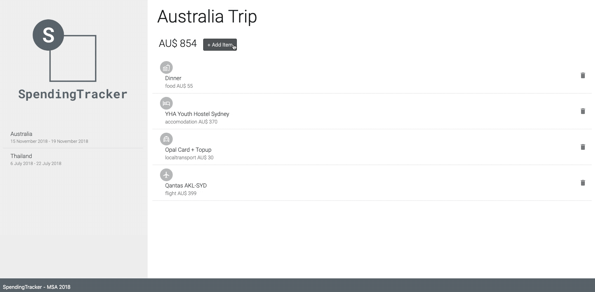

# SpendingTrackerUI

**SpendingTracker** helps you keep track of your spending while on a trip. It's a really simple app that uses RESTful API [endpoint I created](https://github.com/cjan957/SpendingTracker) using .NET Core Web API. Released through Azure DevOps Pipeline and hosted as a WebApp on Azure. SpendingTracker is my second React web application. 
 
 

 

## Features
* *Add a spending record*: add a new record by specifying the title, the price, the category and add a note to it.
* *Spending Record*: select a record to edit and save it. See the extra note stored against the record.
* *Edit a spending record*: Modify the title, price and the note.
* *Delete a spending record*: Click the bin/delete button to delete a record.
* *Face Authentication*: Upon loading the site, face authentication is required via webcam. I used multiple photos of myself to train the model on Microsoft Custom Vision service. This was just something fun I wanted to experiment with. This feature has been removed so that anyone can access the application. The code is still there but commented out.

## Tools/Libaray/Services
* React
* Material UI
* Visual Studio Code
* Microsoft Custom Vision
* Bootstrap | Responsive UI

